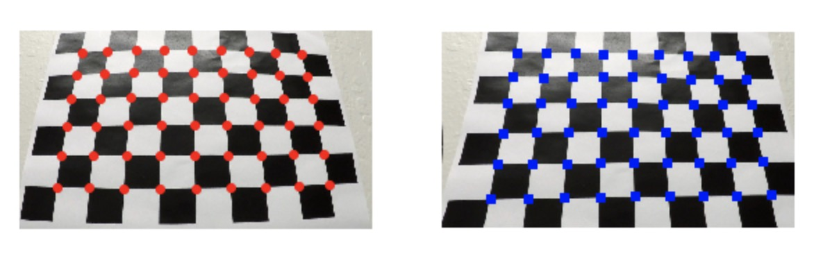
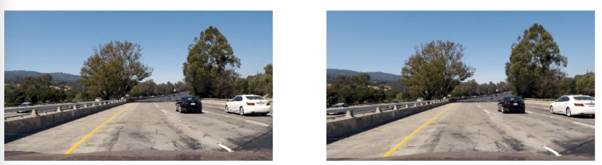
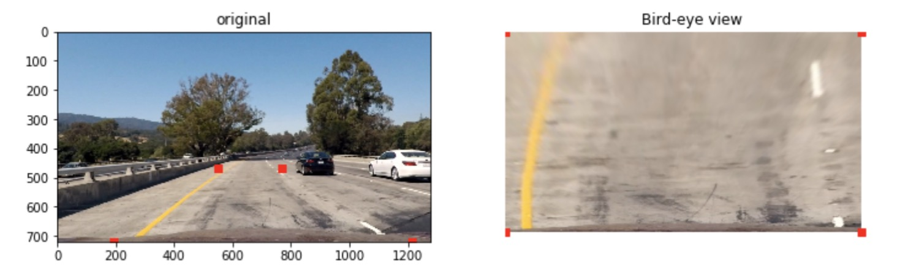
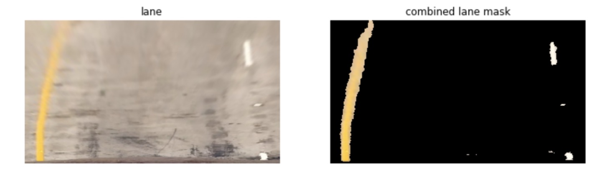
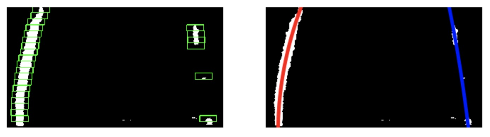

# Advanced Lane Finding Project

The goals / steps of this project are the following:

* Compute the camera calibration matrix and distortion coefficients given a set of chessboard images.
* Apply a distortion correction to raw images.
* Use color transforms, gradients, etc., to create a thresholded binary image.
* Apply a perspective transform to rectify binary image ("birds-eye view").
* Detect lane pixels and fit to find the lane boundary.
* Determine the curvature of the lane and vehicle position with respect to center.
* Warp the detected lane boundaries back onto the original image.
* Output visual display of the lane boundaries and numerical estimation of lane curvature and vehicle position.

### Camera Calibration

The code for this step is contained in the first code cell of the IPython notebook located in "./examples/example.ipynb" (or in lines # through # of the file called `some_file.py`).  

I start by preparing "object points", which will be the (x, y, z) coordinates of the chessboard corners in the world. Here I am assuming the chessboard is fixed on the (x, y) plane at z=0, such that the object points are the same for each calibration image.  Thus, `objp` is just a replicated array of coordinates, and `objpoints` will be appended with a copy of it every time I successfully detect all chessboard corners in a test image.  `imgpoints` will be appended with the (x, y) pixel position of each of the corners in the image plane with each successful chessboard detection.  

I then used the output `objpoints` and `imgpoints` to compute the camera calibration and distortion coefficients using the `cv2.calibrateCamera()` function.  I applied this distortion correction to the test image using the `cv2.undistort()` function and obtained this result: 
```python
objp[:,:2] = np.mgrid[0:9,0:6].T.reshape(-1,2)
ret, corners = cv2.findChessboardCorners(gray, (nx, ny), None)
imgpoints.append(corners)
objpoints.append(objp)
ret, mtx, dist, rvecs, tvecs = cv2.calibrateCamera(objpoints, imgpoints, img_size,None,None)
```


### Pipeline

#### 1. Provide an example of a distortion-corrected image.

To demonstrate this step, I will describe how I apply the distortion correction to one of the test images like this one:
```python
undist = cv2.undistort(img, mtx, dist, None, mtx)
```


#### 2. Perform a perspective transform and provide an example of a transformed image.

The code for my perspective transform includes a function called `convert_image()`,  The `convert_image()` function takes as inputs an image (`img`), as well as source (`src`) and destination (`dst`) points.  I chose the hardcode the source and destination points in the following manner:

```python
height,width = img.shape[:2]
src = np.float32([[0.43*width,0.65*height],
    [0.6*width,0.65*height],
    [0.95*width,1.*height],
    [0.05*width,1.*height]])
dst = np.float32([[0,0],
    [width,0],
    [width,height],
    [0,height]])
```

I verified that my perspective transform was working as expected by drawing the `src` and `dst` points onto a test image and its warped counterpart to verify that the lines appear parallel in the warped image.



#### 3. Use color transform to create a thresholded binary image. 

I used color thresholds to generate a binary image   Here's an example of my output for this step. 
```python
def color_mask(warped):
    image_HSV = cv2.cvtColor(warped,cv2.COLOR_RGB2HSV)
    mask_yellow = cv2.inRange(image_HSV, np.array([10,80,40]), np.array([35,255,255]))
    mask_white = cv2.inRange(image_HSV, np.array([0,0,200]), np.array([180,30,255]))
    combined_mask = cv2.bitwise_or(mask_yellow,mask_white)
    mask_lane = np.zeros_like(combined_mask)
    mask_lane[(combined_mask > 0)] = 1
    return mask_lane
```


#### 4. Identify lane-line pixels and fit their positions with a polynomial.

First, I tried to find effective lane-line pixels that can be used to fit a polynomial. I split images to left sides and right sides. What's more, I split every sides to `nrows` row cells. I calculated every cell lane-line median(if cells contain more than 100 lane-line pixels).
```python
def window_center(mask_img,nrows = 15,threshold =50):
    left_list = [[] for i in range(nrows+1)]
    right_list = [[] for i in range(nrows+1)]
    left_center_list,right_center_list = [],[]
    midpoint = img.shape[1]//2
    window_y_size = mask_img.shape[0]//nrows
    for y_position in range(mask_img.shape[0]):
        for x_position in range(mask_img.shape[1]):
            if mask_img[y_position][x_position] == 1:
                y_window_position = y_position//window_y_size
                if x_position < midpoint:left_list[y_window_position].append(x_position)
                else:right_list[y_window_position].append(x_position)
                    
    for i in range(nrows-1):
        if len(left_list[i]) > threshold:
            left_center_list.append((sorted(left_list[i])[len(left_list[i])//2],int((i+0.5)*window_y_size)))
        if len(right_list[i]) > threshold:
            right_center_list.append((sorted(right_list[i])[len(right_list[i])//2],int((i+0.5)*window_y_size)))
    return left_center_list,right_center_list
```
  Here's an example of my output with `window_center()` and `draw_line()`. 
 


#### 5. Example image of my result plotted back down onto the road such that the lane area is identified clearly.

Here is an example of my result on a test image:
```python
def combine_origin_mask(img,mask_lane,ploty,left_fitx,right_fitx):
    warp_zero = np.zeros_like(mask_lane).astype(np.uint8)
    color_warp = np.dstack((warp_zero, warp_zero, warp_zero))

    pts_left = np.array([np.transpose(np.vstack([left_fitx, ploty]))])
    pts_right = np.array([np.flipud(np.transpose(np.vstack([right_fitx, ploty])))])
    pts = np.hstack((pts_left, pts_right))

    cv2.fillPoly(color_warp, np.int_([pts]), (0,255, 0))
    newwarp = cv2.warpPerspective(color_warp, Minv, (color_warp.shape[1], color_warp.shape[0])) 

    result = cv2.addWeighted(img, 1, newwarp, 0.3, 0)
    plt.imshow(result)
    
    return result
```
![combine_mask][images/combine_mask.jpeg]

---

### Pipeline (video)

#### 1. Provide a link to your final video output.  Your pipeline should perform reasonably well on the entire project video (wobbly lines are ok but no catastrophic failures that would cause the car to drive off the road!).

Here's a [link to my video result](./project_video_result.mp4)

---

### Discussion ane Future Jobs

* Color detection only can detect very specific lanes. If colors are changed because of weather conditions or different light environment, This method will fail.
* Gradient detection will meet problems when texture is very complex.
* Segmentation will be a good function to detect lanes. Some deep learning methods(FCN, Segnet and so on) can detect lanes accurately. I will try......

